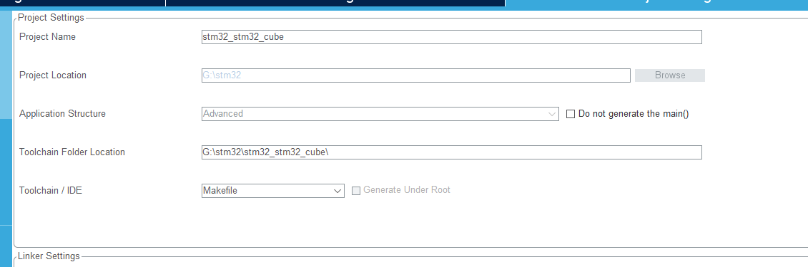
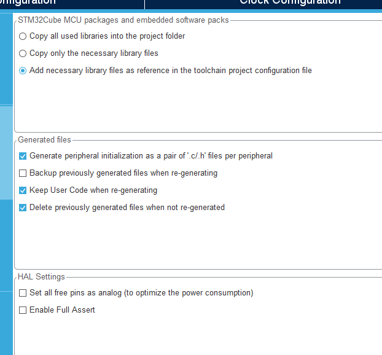

https://docs.platformio.org/en/latest/tutorials/ststm32/stm32cube_debugging_unit_testing.html
https://docs.platformio.org/en/latest/boards/ststm32/nucleo_l053r8.html
[STM32-boards](https://docs.platformio.org/en/latest/boards/index.html#st-stm32)

